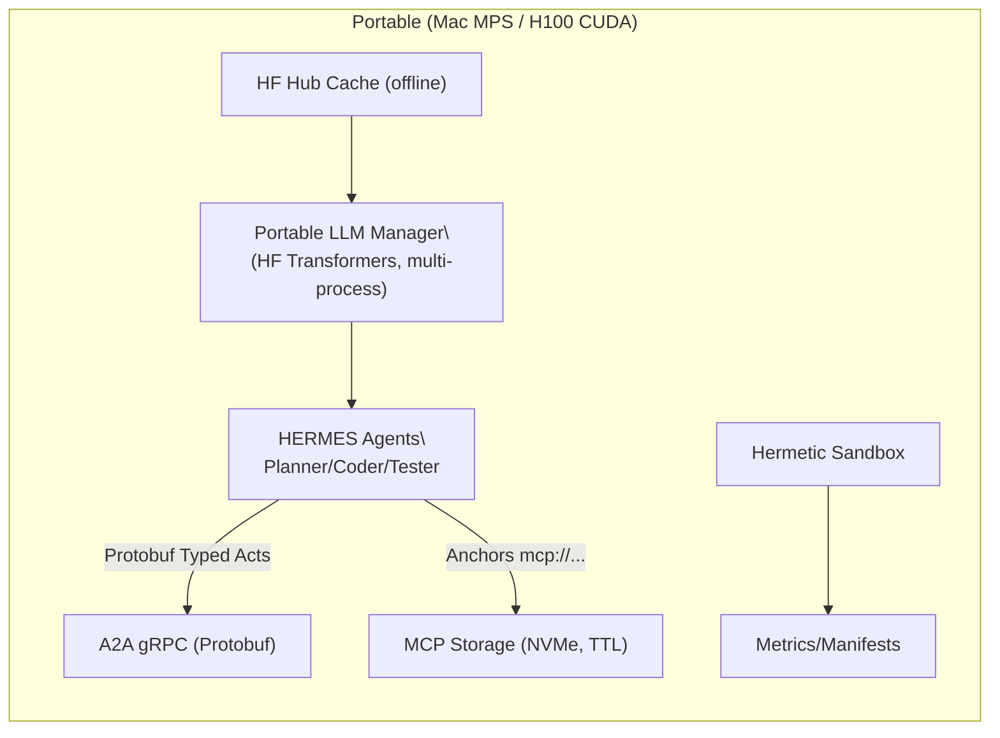

# PR #9 Evidence Addenda

## 1. Offline/Hermetic Section Excerpt (from docs/mvp-spec.md lines 39-68)

```bash
### 2.4 Offline Model/Hub Policy

For hermetic execution and reproducibility:

**Environment Variables**:
```bash
export HF_HUB_OFFLINE=1          # Disable HF Hub network access[^3]
export TRANSFORMERS_OFFLINE=1    # Disable Transformers network access
export HF_HOME="$PWD/.hf"
export HF_HUB_CACHE="$HF_HOME/hub"
export TRANSFORMERS_CACHE="$HF_HOME/transformers"
```

**Code Configuration**:
```python
model = AutoModel.from_pretrained(
    model_name,
    local_files_only=True,  # Force local cache usage
    cache_dir=cache_dir
)
```

**Pre-cache Models** (one-time, online):
```python
from huggingface_hub import snapshot_download
snapshot_download(
    'meta-llama/Meta-Llama-3.1-8B-Instruct',
    local_dir='./.hf/models/meta-llama/Meta-Llama-3.1-8B-Instruct'
)
```

Additional hermetic flags from lines 193-203:

```bash
### Hermetic Execution
```bash
# Set offline flags
export HERMES_HERMETIC=1
export HF_HUB_OFFLINE=1
export TRANSFORMERS_OFFLINE=1
export HF_DATASETS_OFFLINE=1

# Run tests
python -m pytest tests/ -q
```

## 2. Quantization-by-Platform Table (from docs/design_doc.md lines 345-354)

```markdown
## 11. Quantization Compatibility Matrix

| Platform | Architecture | BitsAndBytes | Alternative | Notes |
|----------|-------------|--------------|-------------|-------|
| Linux | CUDA (H100) | ✅ 4/8-bit | - | Full support |
| Linux | CUDA (A100) | ✅ 4/8-bit | - | Full support |
| macOS | MPS (M1/M2/M3) | ❌ | MLX, GGUF | bnb is CUDA-only[^1] |
| Linux | CPU | ❌ | GGUF | Fallback mode |
| Windows | CUDA | ✅ 4/8-bit | - | Experimental |
```

With footnote reference from line 446:
```
[^1]: BitsAndBytes CUDA-only limitation: https://huggingface.co/docs/bitsandbytes
```

Additional platform-specific details from lines 57-78:

```python
### 2.3 Platform-Specific Implementation

#### CUDA (H100/A100)
```python
# Quantization enabled
from transformers import BitsAndBytesConfig

bnb_config = BitsAndBytesConfig(
    load_in_4bit=True,
    bnb_4bit_compute_dtype=torch.float16,
    bnb_4bit_use_double_quant=True
)
```

#### MPS (Apple Silicon)
```python
# No bitsandbytes - use smaller models
model = AutoModelForCausalLM.from_pretrained(
    "meta-llama/Llama-3.2-3B-Instruct",
    device_map="mps",
    torch_dtype=torch.float16
)
```

## 3. Mermaid Diagram Snippet (from docs/diagrams/portable_llm_manager.mmd lines 1-28)

```mermaid
flowchart TB
  subgraph API["Client API Layer"]
    LC["clients/llm_client.py"]:::api
    ENV["HERMES_BACKEND env var"]:::config
  end
  
  subgraph Backend["Portable Multi-Process Backend"]
    PM["llm/portable_manager.py<br/>(PortableMultiInstanceManager)"]:::manager
    
    subgraph Pool["Process Pool (spawn)"]
      P1["Process 1<br/>Model Instance<br/>Device: cuda:0"]:::process
      P2["Process 2<br/>Model Instance<br/>Device: cuda:1"]:::process
      P3["Process 3<br/>Model Instance<br/>Device: mps:0"]:::process
      PN["Process N<br/>Model Instance<br/>Device: cpu"]:::process
    end
    
    subgraph Queue["Request Management"]
      RQ["Request Queue<br/>(Round-robin)"]:::queue
      RM["Response Map<br/>(Future-based)"]:::queue
    end
  end
  
  subgraph Device["Device Abstraction"]
    subgraph CUDA["CUDA GPUs"]
      GPU0["GPU 0<br/>H100/A100"]:::gpu
      GPU1["GPU 1<br/>H100/A100"]:::gpu
    end
```

Also from docs/mvp-spec.md lines 72-93 showing the architecture with MCP and offline cache:



## Additional Evidence: Concurrency Model (from docs/design_doc.md lines 45-54)

```markdown
### 2.2 Concurrency Model

**Process Isolation Strategy**:
We create N processes using `ProcessPoolExecutor` with spawn context, where each process:
1. Loads its own model instance independently
2. Pins to a specific device (CUDA GPU via round-robin, MPS shared device, or CPU)
3. Maintains separate memory space to avoid GIL and thread-safety issues
4. Communicates via serialized messages (pickle protocol)

This ensures true parallelism even when the underlying backend (HF Transformers) may not be thread-safe.
```

## Additional Evidence: Risk Mitigation (from docs/design_doc.md lines 80-88)

```markdown
### 2.4 Risks & Mitigations

| Risk | Impact | Mitigation | Status |
|------|--------|------------|--------|
| BNB unavailable on MPS[^1] | No 4/8-bit quantization on Mac | Use smaller models (≤8B) or MLX/GGUF adapter | Documented |
| HF offline mode failures | Network access during hermetic eval | Use `HF_HUB_OFFLINE=1`, `TRANSFORMERS_OFFLINE=1`, pre-cache models[^2] | Implemented |
| Process spawn overhead | 2-5s startup per instance | Warm-up phase, process pool reuse | Planned |
| Memory fragmentation | OOM on repeated runs | Process recycling after N requests | Planned |
```