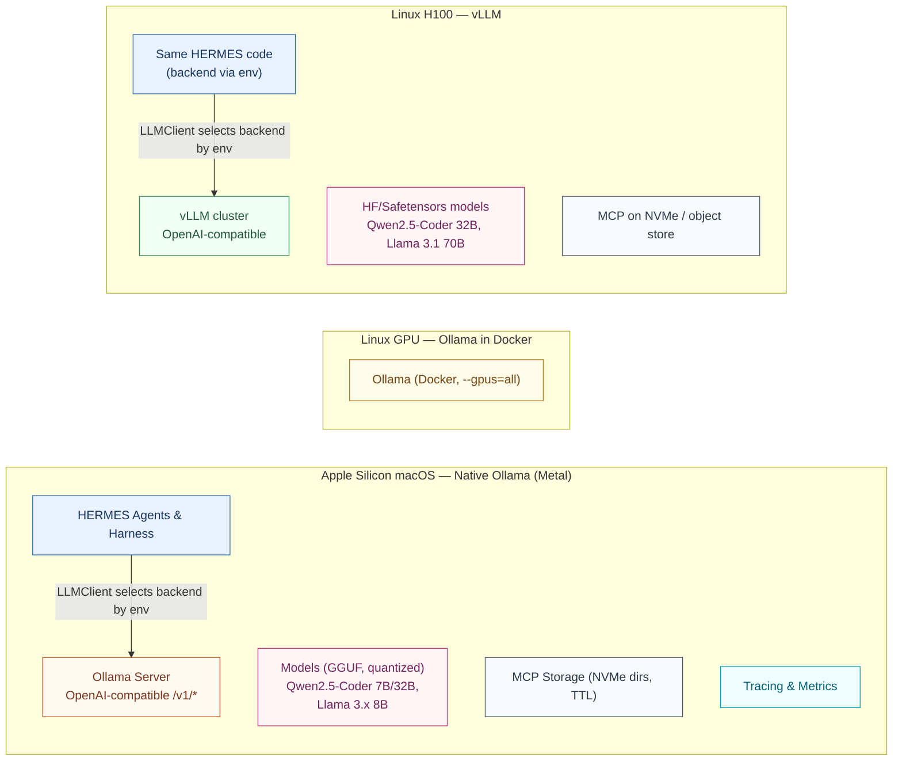
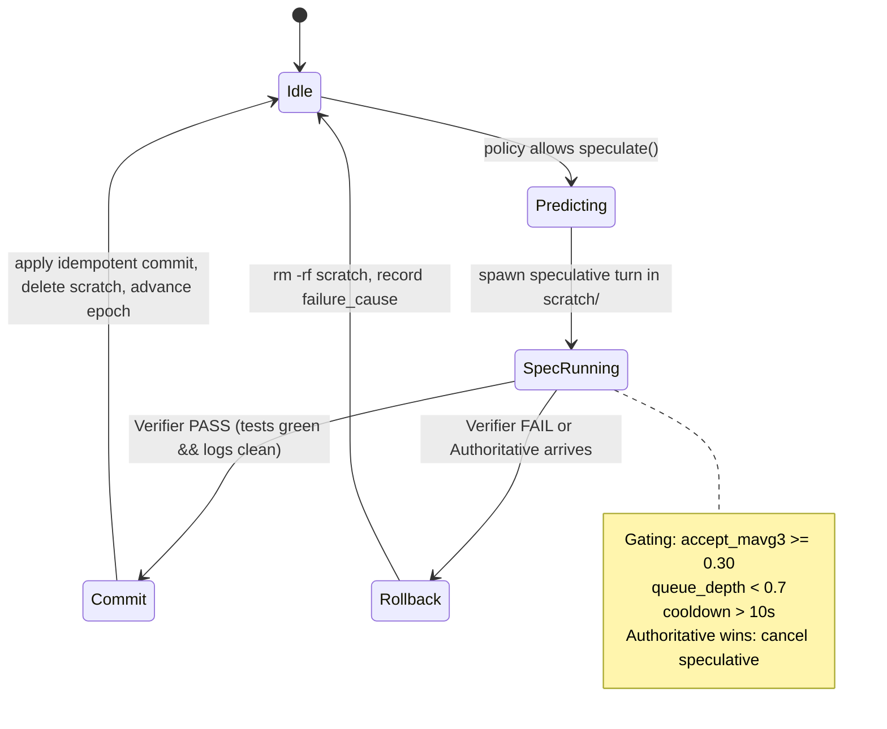
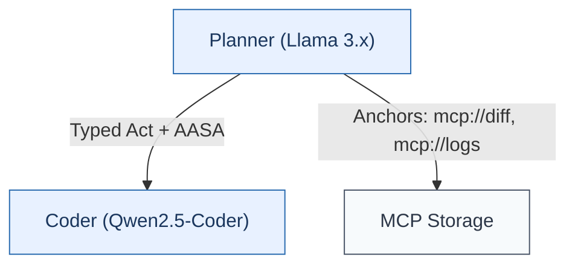

# Project HERMES

**A Communication Stack for Efficient, Heterogeneous Multi‑Agent Workflows**

## 0) Plain‑English Thesis & Motivation

**Thesis (in one sentence):**
In multi‑agent LLM systems, how agents talk and overlap work often dominates speed and cost more than raw model quality. HERMES attacks those friction points head‑on.

### The three levers (with lay examples)

1. **Structured messages instead of chatty text**

   - Typed Acts (think "forms" with fixed fields) and MCP Anchors (links to large files instead of pasting them) cut bytes dramatically while removing ambiguity.
   - _Lay example:_ Instead of emailing a full test log, send the link; instead of a paragraph requesting a patch, send a form with precise fields (file path, task type).

2. **Start next agent early, but only commit if correct**

   - SAE (speculate→verify→rollback): start the Coder while the Planner is finishing; commit only if tests pass; otherwise delete side‑effects.
   - _Lay example:_ Like cooking pasta while your friend finishes chopping; if their recipe differs, you throw away the boiled pasta (cheap) and start again—you saved time if you guessed right.

3. **Heterogeneous teams without long prompts**
   - AASA (latent + symbolic intent): send a header with exact facts (file path, test) + a tiny latent vector encoding "style/soft intent."
   - _Lay example:_ The shipping label (symbolic header) plus a yellow sticky note ("prefer iterative patch; avoid big refactors") instead of a long letter. The sticky note is compact and easy to translate between models.

### Why this approach—and what breaks without it?

- Without Typed/Anchors/LBE, agents shove huge JSON/NL and logs through the pipe → slow parsing, more tokens, and more errors.
- Without AASA, heterogeneous teams fall back to long prompts to "translate" intent → more tokens, drift, and fragile handoffs.
- Without SAE, every agent waits for the previous → avoidable round‑trips dominate wall‑clock time.

We limit scope to 3–4 agents (Planner, Coder, Tester, optional Critic) and validate first on M1 (64 GB) with Ollama (Metal), then migrate to 4× H100 via vLLM for production‑scale throughput.

## 1) Targets, SLOs & Figures of Merit (design goals, not results)

### Primary Targets

- **Latency:** ≥ 30% reduction in end‑to‑end p50 vs. A2A JSON
  - Start: planner receives task. End: tester returns final verdict. Clock: monotonic.
- **Tokens/Bytes:** ≥ 40% reduction per solve with no worse than ±2 pp pass@1

### Performance SLOs

- **Message path p95** (encode + transport + decode, proc→proc):
  - Goal H100: < 10 ms
  - Acceptable H100: < 20 ms
  - M1: < 35 ms
  - _Fallback threshold:_ < 50 ms before degrading to simpler protocol
- **MCP dereference p95:** < 50 ms (local NVMe)
- **SAE rollback p95:** < 150 ms
  - _Acceptable fallback:_ < 250 ms for large artifacts

### Throughput Targets

- **Dev tokens/s (Apple Silicon, interactive coding):** ≥ 25 tokens/s (aggregate)
  - _Measurement:_ Sum of concurrent generation rates across active models
  - _Warmup:_ Exclude first 5 inference calls after model load
- **Prod throughput (H100, batched):** ≥ 500 tokens/s (aggregate)
  - _Measurement:_ True parallel throughput under load

### Reproducibility

One CLI seeds Python/NumPy/PyTorch, logs model/tokenizer SHAs, dataset SHAs.

### Figures of Merit

- **Primary:** p50/p95 E2E latency, tokens (prefill vs decode), bytes on wire, pass@1
- **Secondary:** message‑path p95, MCP p95, LBE decode error, AASA arg‑accuracy, SAE acceptance & rollback overhead, RL OPE (DR CIs), dev/prod tokens/s

## 2) Dev↔Prod Strategy, Models, Quantization, and Why

We adopt the hybrid strategy:

### Development (Apple Silicon M‑series)

- Ollama, **native macOS** (not Docker) to leverage Metal Performance Shaders
- **Critical:** Docker on macOS cannot access Metal → **zero GPU acceleration** (not just reduced performance)

### Staging (Linux GPU)

- Ollama in Docker with NVIDIA toolkit for integration tests

### Production (H100)

- vLLM, OpenAI‑compatible, high throughput & batching

### 2.1 Architecture Overview



### 2.2 Apple Silicon (dev) — Installation & Metal Acceleration

Install natively:

```bash
brew install ollama  # or official script
file $(which ollama)  # verify arm64 binary
```

Metal environment configuration:

```bash
export OLLAMA_GPU_LAYERS=-1
export OLLAMA_CONTEXT_LENGTH=2048      # tune for memory pressure
export PYTORCH_ENABLE_MPS_FALLBACK=1
export PYTORCH_MPS_HIGH_WATERMARK_RATIO=0.0
```

Configuration file (`~/.ollama/config.json`):

```json
{
  "gpu_layers": -1,
  "context_length": 4096,
  "batch_size": 512,
  "threads": 8,
  "use_mps": true,
  "memory_map": true
}
```

Memory pressure monitoring thresholds:

```bash
# Add to scripts/mem_watch.py
if memory_pressure | grep "System-wide memory free percentage: [0-4]%"; then
  echo "CRITICAL: Memory pressure too high"
  # Trigger model unload or context reduction
fi
```

### 2.3 Model Selection & Quantization

**Dev default (64 GB Mac):**

- Qwen2.5‑Coder 7B/32B (GGUF; Q4_K_M)
- Llama 3.x 8B (Q4_K_M)
- Avoid IQ series on Apple Silicon; prefer Q4_K_M, Q5_K_M, Q6_K

**Per‑tier guidance:**

- **8 GB:** Qwen2.5‑Coder 1.5B
- **16 GB:** Qwen2.5‑Coder 7B, Llama 3.x 8B (heavier quant)
- **32 GB:** Qwen 32B feasible at ~10–15 tok/s; context 2048–4096
- **64 GB+:** Comfortable with multiple models loaded; target ≥25 tok/s overall

**Important:** GGUF→HF conversion is not generally supported. For production (vLLM), source models directly from HuggingFace rather than attempting conversion.

### 2.4 Staging (Linux GPU) and Production (H100 + vLLM)

**Staging (Docker):**

```yaml
# docker-compose.yml
services:
  ollama:
    image: ollama/ollama:latest
    deploy:
      resources:
        reservations:
          devices:
            - driver: nvidia
              count: all
              capabilities: [gpu]
    environment:
      - OLLAMA_NUM_PARALLEL=4
      - OLLAMA_MAX_LOADED_MODELS=2
      - OLLAMA_KEEP_ALIVE=5m
    volumes:
      - ollama_models:/root/.ollama/models
      - ollama_config:/root/.ollama/config
      - ollama_cache:/root/.ollama/cache
    healthcheck:
      test: ['CMD', 'curl', '-f', 'http://localhost:11434/api/health']
      interval: 30s
      timeout: 10s
      retries: 3
```

**Production (vLLM):**

- Deploy HF/safetensors models directly (not GGUF)
- Long contexts supported
- K8s canary deployments
- Throughput target: ≥500 tok/s aggregate, P99 latency tracked

### 2.5 Unified Client Interface & API Differences

```python
# clients/llm_client.py
class LLMClient:
    def __init__(self):
        backend = os.environ.get('HERMES_BACKEND', 'ollama')
        if backend == 'ollama':
            self.client = OllamaClient()
        elif backend == 'vllm':
            self.client = VLLMClient()
        self._warmup()

    def _warmup(self):
        """Run 5 inference calls to stabilize performance"""
        for _ in range(5):
            self.client.generate("warmup prompt", max_tokens=10)
```

**Feature gaps:** logprobs & some advanced knobs may not exist on Ollama; clients must degrade gracefully.

## 3) Terminology (with examples)

- **Typed Act:** A compact, schema‑ed message; e.g., `REQUEST{task_type=PATCH, file_path="a.py", test="test_foo"}`
- **MCP Anchor:** A pointer to an artifact; e.g., `mcp://logs/1234`
- **AASA:** Aligned Agent Semantic Adapter = symbolic header (exact fields) + tiny latent (soft intent)
- **LBE:** Learned Binary Encoding that never throws on decode → returns `(ok, payload, err)`; framed with CRC
- **SAE:** Speculative Agent Execution: start downstream work early; verify via unit tests; rollback fast if mismatch
- **RL Shield:** Hard constraints that override the policy when safety/quality is at risk

## 4) Protocols & Transport

### Protobuf Schema (`proto/acts.proto`)

```protobuf
syntax = "proto3";
package hermes;
enum ActType {
  REQUEST = 0;
  INFORM  = 1;
  PROPOSE = 2;
  CONFIRM = 3;
  ERROR   = 4;
}
enum TaskType {
  PATCH     = 0;
  REFACTOR  = 1;
  TEST_FIX  = 2;
}
message SymbolicHeader {
  string repo      = 1;
  string file_path = 2;
  string test_name = 3;
  TaskType task_type = 4;
  string tool_id   = 5;
}
message AASALatent {
  bytes vector = 1;  // int8-quantized (768-d)
}
message TypedAct {
  string trace_id  = 1;
  ActType act_type = 2;
  SymbolicHeader header = 5;

  oneof payload {
    AASALatent aasa_latent = 10;
    bytes lbe_blob = 11;
    string mcp_ref = 12;
    string accp_text = 13;
  }

  uint32 schema_version = 20;
  string schema_hash    = 21;
  string epoch          = 22;
  string sender         = 23;
  string receiver       = 24;
  string span_id        = 25;
}
```

**gRPC A2A:** `Send(TypedAct)->Ack` with (epoch, span_id) de‑dup

- Local RTT p95 target: < 5 ms (aggressive but achievable with optimization)
- Fallback: < 10 ms acceptable for initial implementation

## 5) AASA: Latent + Symbolic Cross‑Model Intents

### 5.1 Data Recipe & Meta‑prompt

```python
META_PROMPT = """
You are the {AGENT_ROLE}. You need to communicate the following intent:
Task: {TASK_TYPE}; File: {FILE_PATH}; Repo: {REPO}; Test: {TEST_NAME}.
Produce a concise prompt sketch (1–3 sentences) capturing style/soft intent.
Do NOT repeat repo/file_path/test_name—they'll be provided separately.
"""
```

### 5.2 Training Objective (verified math)

**Procrustes initialization:**
Given embedding pairs (X,Y), solve min_W ||WX - Y||²_F

With SVD of YX^T = UΣV^T, set W = UV^T

**Loss function:**

```
L = ||Wx_L - y_Q||²₂ + λ·L_InfoNCE(Wx_L, y_Q)
```

**InfoNCE with cosine similarity and temperature τ=0.07:**

```
L_InfoNCE = -1/B Σᵢ log[exp(cos(zᵢ,zᵢ⁺)/τ) / Σⱼ exp(cos(zᵢ,zⱼ⁺)/τ)]
```

**Hyperparameters:**

- AdamW (lr=3e-4, wd=0.01)
- Batch 256, epochs 5, λ=0.1
- Embeddings: BGE-M3 (768-d), frozen
- Quantization: symmetric per-channel int8
  **Acceptance criteria (D3 vs D2):**
- bytes/turn ≤ 0.7×
- arg‑accuracy ≥ 99%
- Δpass@1 ≥ −2 pp

## 6) LBE: Learned Binary Encoding

**Framing:** `[Magic][Version][SchemaHash][Len][Payload][CRC32]`

```python
def decode(buf: bytes) -> Tuple[bool, Optional[dict], Optional[str]]:
    """Never throws - returns (ok, obj, err)"""
    try:
        # Verify magic, version, CRC
        if not verify_frame(buf):
            return False, None, "Invalid frame"
        # Decode payload
        obj = decode_payload(buf)
        return True, obj, None
    except Exception as e:
        # Log and fallback to Protobuf
        logger.warning(f"LBE decode failed: {e}, falling back")
        return False, None, str(e)
```

**Targets:**

- Decode error ≤ 0.5%
- p95 enc+dec ≤ 5 ms (M1)

## 7) SAE: Speculative Agent Execution

### Isolation & Rollback

- Scratch dirs: `scratch/<task>/<spec_id>/`
- No Docker on M1 (avoids overhead)
- Rollback SLO: < 150 ms (< 250 ms acceptable for large artifacts)

### Gating Conditions

Speculate iff:

- accept‑mavg3 ≥ 0.30
- queue_depth < 0.7
- last rejection > 10s

### 7.1 Content Predictor (the "what")

```python
class SAEContentPredictor:
    def predict_next_header(self, state: dict) -> Tuple[SymbolicHeader, float]:
        """Predict next act's content with calibrated confidence"""
        # Fast MLP/GBDT inference
        header = self.model.predict(state)
        confidence = self.model.predict_proba(state).max()
        return header, confidence
```

**Acceptance:**

- p95 inference < 10 ms
- ≥70% exact match on key fields
- Calibrated probabilities (ECE ≤ 0.1)

## 8) RL: When to Speculate (Policy)

### 8.1 MDP Ingredients

**State s_t (normalized):**

| Feature                       | Type | Normalization    |
| ----------------------------- | ---- | ---------------- |
| task.repo_size_kb             | f32  | log1p → z‑score  |
| task.num_files_changed_so_far | i32  | z‑score          |
| task.avg_file_len_changed     | f32  | z‑score          |
| task.task_type_one_hot[3]     | f32  | 0/1              |
| task.file_ext_one_hot[3]      | f32  | 0/1              |
| sys.queue_depth               | f32  | 0–1              |
| sys.cpu_load                  | f32  | z‑score          |
| hist.sae_accept_mavg3         | f32  | 0–1              |
| hist.rollback_ms_mavg3        | f32  | z‑score          |
| hist.bytes_mavg3              | f32  | z‑score          |
| aasa.arg_accuracy_prev        | f32  | 0/1              |
| aasa.latent_cos_sim_prev      | f32  | 0–1              |
| aasa.header_valid_prev        | f32  | 0/1              |
| pred.p_accept_pred            | f32  | 0–1 (calibrated) |

**Actions a_t:**

- NO_SPEC(AASA ON)
- SPEC(T0, AASA ON)
- SPEC(T1, AASA ON)
- NO_SPEC(AASA OFF)
- SPEC(T0, AASA OFF)

**Reward:**

```
r_t = -α·Δlatency_t - β·Δbytes_t - γ·1[final fail]
```

Start: α=1.0, β=0.1, γ=5.0

**Constraint:** Pr(pass@1 drop > 2pp) ≤ 1%

### 8.2 Safety Shield (hard rules)

```python
def apply_safety_shield(state, action):
    # Force NO_SPEC conditions
    if state['pred.p_accept_pred'] < 0.25:
        return NO_SPEC
    if state['sys.queue_depth'] >= 0.7:
        return NO_SPEC
    if time_since_last_rejection() < 10:
        return NO_SPEC

    # Force AASA ON
    if recent_arg_accuracy() < 0.99:
        action = force_aasa_on(action)

    # Force Protobuf fallback
    if recent_lbe_errors() > 0.005:
        action = force_protobuf(action)

    return action
```

### 8.3 Offline Policy Evaluation (OPE)

**Doubly Robust estimator (AIPW form):**

```
V̂_DR(π) = 1/N Σᵢ [E_a~π(·|sᵢ) Q̂(sᵢ,a) + π(aᵢ|sᵢ)/μ(aᵢ|sᵢ) (rᵢ - Q̂(sᵢ,aᵢ))]
```

- Q̂ via ridge/MLP
- Bootstrap CIs
- Cap importance weights ≤ 10

**Accept:** DR-CI shows ≥0 improvement with no pass@1 harm

## 9) Benchmarks & Datasets

- **Primary:** SWE‑bench Lite (~300 tasks) with strict unit‑test verification
- **Optional:** SWE‑bench Verified, MBPP/HumanEval
- **AASA corpus:** Paired sketches from D1/D2 runs
- **LBE corpus:** ≥10k payloads from D1
- **Throughput benchmarks:** Apple Silicon ≥25 tok/s, vLLM ≥500 tok/s

## 10) Codebase Layout

```
hermes/
  pyproject.toml  Makefile
  configs/
    generation.yaml        # sampling/stop (single source)
    budgets.yaml          # SLOs & guards
    swebench_lite.yaml    # splits
    aasa_train.yaml       # lr, wd, epochs, λ, τ
    rl_bandit.yaml        # α, β, γ, priors, ε
    env.dev.yaml          # Ollama base_url, models, quant
    env.staging.yaml      # Dockerized Ollama
    env.prod.yaml         # vLLM base_url
  proto/acts.proto
  transport/grpc_impl.py
  clients/
    llm_client.py         # Abstract with warmup
    ollama_client.py
    vllm_client.py
  agents/
    base_agent.py
    planner_llama.py
    coder_qwen.py
    tester_llama.py
    critic_llama.py
    typed_act_client.py
  mcp/
    server.py
    clients.py
    storage/
  codec/
    lbe_codec.py
    lbe_train.py
    microbench.py
  aasa/
    dataset.py
    train.py
    bridge.py
    metrics.py
    faiss_index/
  sae/
    manager.py
    predictor.py
    policy_heuristic.py
    verifier.py
  rl/
    features.py
    bandit.py
    actor_critic.py
    ope.py
    metrics.py
  eval/
    run_arms.py
    bootstrap.py
    power.py
    figures.py
    bench_tokens.py
  scripts/
    prepare_swebench.sh
    collect_lbe_corpus.py
    run_local_m1.sh
    launch_vllm_h100.sh
    mem_watch.py         # Memory pressure monitor
    ollama_modelfiles/
  docs/
    # Per-task summaries: docs/M{}/F{}/T{}_summary.md
```

## 11) Milestones → Features → Tasks

### M0 — Environment, Clients, Harness (Dev on M1; Week 0–1)

#### F0.1 — Apple Silicon native setup (Metal)

**T0.1 — Install & verify Ollama (native, arm64)**

- Install and verify `file $(which ollama)` shows arm64
- Configure MPS with environment variables
- Implement memory pressure monitoring with specific thresholds
- **Accept:** ollama --version ok; MPS enabled; simple /v1/models call works
- **Summary:** docs/M0/F0.1/T0.1_summary.md

**T0.2 — Quantized models & Modelfiles**

- Pull Qwen2.5‑Coder 7B/32B (Q4_K_M) and Llama 3.x 8B (Q4_K_M)
- Create Modelfiles with reproducible configs
- Implement model warmup (5 calls excluded from metrics)
- **Tests:** eval/bench_tokens.py with warmup phase
- **Accept:** ≥25 tokens/s aggregate (sum of concurrent rates); memory stable
- **Summary:** docs/M0/F0.1/T0.2_summary.md

**T0.3 — Memory guardrails for unified memory**

- Implement scripts/mem_watch.py with critical thresholds (0-4% free = critical)
- Configure OLLAMA_MAX_MEMORY appropriately
- **Accept:** No swap storms, no kernel OOM; peak memory < threshold
- **Summary:** docs/M0/F0.1/T0.3_summary.md

#### F0.2 — Unified LLM Client

**T0.4 — clients/llm_client.py with warmup**

- Abstract client with OllamaClient implementation
- Implement 5-call warmup phase
- Graceful degradation for missing features
- **Accept:** ≥25 tok/s dev target (post-warmup) on M1
- **Summary:** docs/M0/F0.2/T0.4_summary.md

**T0.5 — vllm_client.py stub**

- Same API surface as OllamaClient
- **Accept:** Unit tests pass with mocked server
- **Summary:** docs/M0/F0.2/T0.5_summary.md

#### F0.3 — Eval harness & parity

**T0.6 — eval/run_arms.py + parity enforcement**

- CLI with strict config enforcement
- Deterministic seeding across all components
- **Accept:** Identical metrics from same seed; config overrides rejected
- **Summary:** docs/M0/F0.3/T0.6_summary.md

#### F0.4 — Baseline agents & transport

**T0.7 — agents/base_agent.py + SWE‑bench env**

- Ephemeral git worktree management
- **Accept:** Unit tests pass; worktree lifecycle correct
- **Summary:** docs/M0/F0.4/T0.7_summary.md

**T0.8 — Arm A (NL JSON baseline)**

- Complete baseline implementation
- **Accept:** 5 tasks end-to-end; metrics logged
- **Summary:** docs/M0/F0.4/T0.8_summary.md

**T0.9 — gRPC A2A transport**

- Implement with fallback thresholds
- **Accept:** Local RTT p95 < 5 ms (< 10 ms acceptable)
- **Summary:** docs/M0/F0.4/T0.9_summary.md

**T0.10 — Arm C (Protobuf baseline)**

- **Accept:** Runs 5 tasks; bytes/solve measured
- **Summary:** docs/M0/F0.4/T0.10_summary.md

### M1 — Substrate (Anchors + Typed Acts; Week 1–2)

#### F1.1 — MCP Anchors

**T1.1 — MCP server with TTLs**

- Implement put/resolve/stat with TTL management
- **Accept:** Deref p95 < 50 ms; TTL expiry tested
- **Summary:** docs/M1/F1.1/T1.1_summary.md

**T1.2 — Arm PM (Protobuf + MCP)**

- Replace inline blobs with anchors
- **Accept:** Bytes/solve < C; pass@1 within ±2 pp
- **Summary:** docs/M1/F1.1/T1.2_summary.md

#### F1.2 — Typed Acts

**T1.3 — proto/acts.proto + content negotiation**

- Full schema implementation with versioning
- **Accept:** D1 runs; bytes drop vs PM; versioning works
- **Summary:** docs/M1/F1.2/T1.3_summary.md

### M2 — LBE (Week 2–3)

#### F2.0 — Data

**T2.0 — Collect LBE corpus**

- Run D1 over full SWE-bench Lite
- **Accept:** ≥10k payloads; reproducible corpus
- **Summary:** docs/M2/F2.0/T2.0_summary.md

#### F2.1 — Codec

**T2.1 — codec/lbe_codec.py (safe, framed)**

- Implement never-throw decode with CRC
- **Tests:** 1k fuzz iterations → 0 crashes
- **Accept:** Decode error ≤ 0.5%; p95 enc+dec ≤ 5 ms
- **Summary:** docs/M2/F2.1/T2.1_summary.md

**T2.2 — Microbench & integrate (Arm D2)**

- Performance validation and integration
- **Accept:** D2 stable; fallback metrics logged
- **Summary:** docs/M2/F2.1/T2.2_summary.md

### M3 — AASA (Week 4–6)

#### F3.1 — Data & training

**T3.1 — AASA dataset builder**

- Generate paired sketches with BGE-M3
- Create hard negatives and cross-model pairs
- **Accept:** ≥10k pairs; reproducible splits
- **Summary:** docs/M3/F3.1/T3.1_summary.md

**T3.2 — Train bridge**

- Procrustes initialization
- InfoNCE training with correct temperature
- **Accept:** Val metrics improve; saved artifacts
- **Summary:** docs/M3/F3.1/T3.2_summary.md

#### F3.2 — Online decode & hydration

**T3.3 — bridge.py + decode_to_prompt**

- FAISS retrieval with fallback
- Header always overrides sketch
- **Accept:** Bytes ≤ 0.7×; arg-accuracy ≥ 99%; Δpass@1 ≥ −2 pp
- **Summary:** docs/M3/F3.2/T3.3_summary.md

### M4 — SAE + RL (Week 6–7)

#### F4.1 — Isolation & prediction

**T4.1 — SAE state manager**

- Scratch directory isolation
- Fast rollback implementation
- **Accept:** Rollback p95 < 150 ms (< 250 ms acceptable)
- **Summary:** docs/M4/F4.1/T4.1_summary.md

**T4.1.5 — SAE content predictor**

- Fast header prediction with calibration
- **Accept:** p95 < 10 ms; ≥70% accuracy; ECE ≤ 0.1
- **Summary:** docs/M4/F4.1/T4.1.5_summary.md

**T4.2 — Heuristic gating policy**

- Implement gating conditions
- **Accept:** Correct toggle behavior
- **Summary:** docs/M4/F4.1/T4.2_summary.md

#### F4.2 — Verifier & D4 wiring

**T4.3 — Verifier (pytest + log regex)**

- Test classification (green/red/flaky)
- **Accept:** Consistent classification; SLO met
- **Summary:** docs/M4/F4.2/T4.3_summary.md

**T4.4 — D4 integration**

- Full SAE pipeline with cancellation
- **Smoketest:** ≥50 tasks; p50(D4) ≤ 0.9×p50(D3); accept ≥35%
- **Summary:** docs/M4/F4.2/T4.4_summary.md

#### F4.3 — RL gating

**T4.5 — Features**

- Deterministic state vectors
- **Accept:** Reproducible features
- **Summary:** docs/M4/F4.3/T4.5_summary.md

**T4.6 — Offline accept predictor**

- Calibrated logistic regression
- **Accept:** AUC ≥ 0.70; ECE ≤ 0.10
- **Summary:** docs/M4/F4.3/T4.6_summary.md

**T4.7 — Contextual bandit (Thompson)**

- Bayesian ridge with safety shield
- **Accept:** Shield enforced; valid logs for OPE
- **Summary:** docs/M4/F4.3/T4.7_summary.md

**T4.8 — OPE (DR estimator)**

- Standard AIPW implementation
- **Accept:** DR-CI ≥ 0; no pass@1 harm
- **Summary:** docs/M4/F4.3/T4.8_summary.md

**T4.9 — (Optional) Constrained actor-critic**

- PPO-style with cost critic
- **Accept:** Stable offline; small canary
- **Summary:** docs/M4/F4.3/T4.9_summary.md

### M5 — ACCP (Optional; Week 7–8)

**T5.1 — Negotiation & streaming**

- Only if residual NL > 10% post-D4
- **Accept:** 10:1+ compression; p95 overhead ≤ 5 ms
- **Summary:** docs/M5/F5/T5.1_summary.md

### M6 — Final Evaluation (Week 8–10)

**T6.1 — Stats & power**

- Paired bootstrap, Wilcoxon tests
- **Accept:** CIs and power analysis complete
- **Summary:** docs/M6/F6/T6.1_summary.md

**T6.2 — Figures & tables**

- Reproducible visualizations
- **Accept:** All figures + manifest
- **Summary:** docs/M6/F6/T6.2_summary.md

### M7 — Staging on Linux (Ollama in Docker)

#### F7.1 — Docker GPU staging

**T7.1 — Compose + NVIDIA toolkit**

- Full Docker configuration with health checks
- **Accept:** /v1/models responds; ≥41 TPS; health green
- **Summary:** docs/M7/F7.1/T7.1_summary.md

#### F7.2 — Client flip & regression

**T7.2 — Switch backend via HERMES_BACKEND**

- Environment-based backend selection
- **Accept:** All arms succeed; no pass@1 regression
- **Summary:** docs/M7/F7.2/T7.2_summary.md

### M8 — Production (vLLM on H100)

#### F8.1 — vLLM deploy

**T8.1 — Model sources & server**

- **Note:** Use HF/safetensors directly (not GGUF conversion)
- **Accept:** ≥500 tok/s aggregate; P99 logged
- **Summary:** docs/M8/F8.1/T8.1_summary.md

#### F8.2 — Client switch & canaries

**T8.2 — HERMES_BACKEND=vllm**

- 10% canary deployment
- **Accept:** Pass@1 parity; predictable gains
- **Summary:** docs/M8/F8.2/T8.2_summary.md

### M9 — CI/CD, Config & Multi-model

#### F9.1 — Env configs

**T9.1 — Environment-specific configs**

- Dev: Q4, 2k context
- Staging: Q8, 4k context
- Prod: Full precision, 32k context
- **Accept:** `make env=dev|staging|prod` works
- **Summary:** docs/M9/F9.1/T9.1_summary.md

#### F9.2 — Multi-model serving

**T9.2 — Model rotation & caching**

- Usage-aware eviction policy
- **Accept:** No OOMs; switch metrics logged
- **Summary:** docs/M9/F9.2/T9.2_summary.md

#### F9.3 — CI pipeline

**T9.3 — GitHub Actions**

- Automated testing and artifact storage
- **Accept:** Green CI; downloadable artifacts
- **Summary:** docs/M9/F9.3/T9.3_summary.md

#### F9.4 — Custom models

**T9.4 — Modelfiles & LoRA adapters**

- Custom model support documentation
- **Accept:** Custom model loads; lineage tracked
- **Summary:** docs/M9/F9.4/T9.4_summary.md

## 12) Diagrams

### 12.1 SAE Life-cycle



### 12.2 Data/Control Paths



## 13) Testing & Edge Cases

- **Long artifacts:** Verify no inline payload >256 KB from D1 onward
- **Flaky tests:** N=2 disagreement → classify FLAKY
- **Network hiccups:** +50 ms RTT injection; ensure SAE still yields speedup
- **Codec corruption:** 1k fuzz iterations → 0 crashes
- **AASA guardrails:** Cosine < threshold → Protobuf fallback
- **Memory pressure:** Automatic model unloading when free < 5%

## 14) Runbook (Dev → Eval)

```bash
# 0) Prepare SWE-bench Lite
bash scripts/prepare_swebench.sh

# 1) Baselines
python -m eval.run_arms --arm A  --seed 1 --gen_cfg configs/generation.yaml
python -m eval.run_arms --arm C  --seed 1 --gen_cfg configs/generation.yaml
python -m eval.run_arms --arm PM --seed 1 --gen_cfg configs/generation.yaml

# 2) D1 and LBE (D2)
python -m eval.run_arms --arm D1 --seed 1 --gen_cfg configs/generation.yaml
python -m scripts.collect_lbe_corpus
python -m codec.microbench
python -m eval.run_arms --arm D2 --seed 1 --gen_cfg configs/generation.yaml

# 3) AASA (D3)
python -m aasa.train --cfg configs/aasa_train.yaml
python -m eval.run_arms --arm D3 --seed 1 --gen_cfg configs/generation.yaml

# 4) RL prep & OPE
python -m rl.features dump --run runs/D3/...
python -m rl.bandit --warmstart --cfg configs/rl_bandit.yaml
python -m rl.ope --logged runs/D3_epsilon/ --policy artifacts/rl_bandit.pkl

# 5) SAE + RL (D4)
python -m eval.run_arms --arm D4 --seed 1 --gen_cfg configs/generation.yaml

# 6) Stats & figures
python -m eval.bootstrap --a runs/C/summary.parquet --b runs/D4/summary.parquet
python -m eval.figures  --runs runs/A runs/C runs/PM runs/D1 runs/D2 runs/D3 runs/D4
```

## 15) Math & Correctness Notes

- ✓ Procrustes solution W = UV^T minimizes Frobenius norm
- ✓ InfoNCE with cosine similarity, temperature τ = 0.07
- ✓ DR estimator uses standard AIPW form
- ✓ Importance weights capped at 10 for variance control
- ✓ Safety shield with hard constraints

## 16) Cut-List (time/compute triage)

- Skip ACCP unless residual NL > 10% after D4
- Prefer contextual bandit over PPO initially
- Keep speculation depth = 1
- Use FAISS retrieval (no generative decoder)

## 17) Per-Task Summary Template

```markdown
# Task T{task}: {title}

## What changed

- Files:
- Key classes/functions:
- Configs added/modified:

## Why this change

- Plain-English motivation:
- What breaks without it:

## How it works

- Algorithms/equations:
- Edge cases handled:

## Tests run

- Unit:
- Integration:
- Results: p50/p95, error rates, CIs, tokens/s

## Metrics impact

- Bytes/solve (before → after):
- Message-path p95:
- Pass@1 delta:
- SAE accept & rollback:
- RL OPE (DR CI):
- Dev/Prod tokens/s:

## Deviations from spec

- (If any)

## Next steps

- ...
```

## Implementation Priority

Based on value and dependencies:

1. **M0, F0.2, T0.4:** Unified LLM Client (enables all downstream)
2. **M0, F0.3, T0.6:** Eval harness (ensures reproducibility)
3. **M1:** MCP Anchors + Typed Acts (immediate wins)
4. **M4:** SAE (biggest latency reduction)
5. **M3:** AASA (heterogeneous model support)

## Where to Start

Ready to implement? Ask Claude Code to:

- `"Implement M0, F0.3, T0.6"` — the parity-enforcing eval harness
- `"Implement M0, F0.2, T0.4"` — the unified LLM client with benchmarks

Each task produces a summary in `docs/M*/F*/T*_summary.md` for review and iteration.
