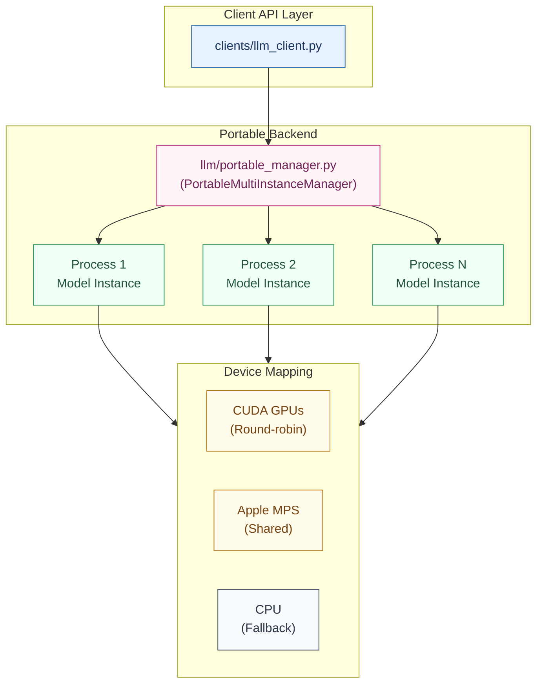
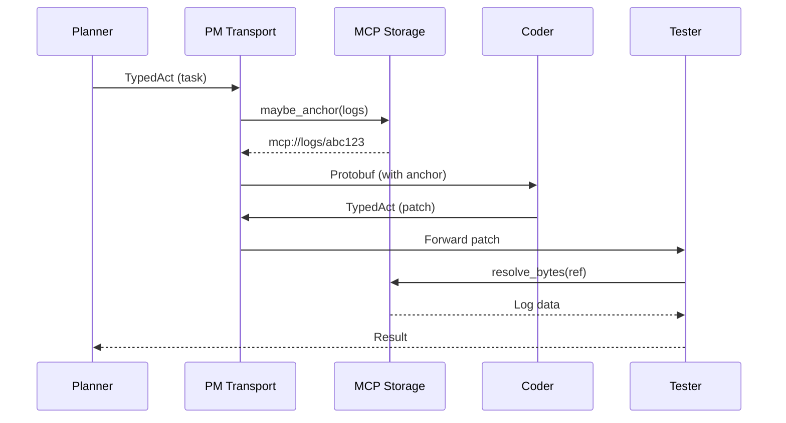

# HERMES Design Document

## 1. Executive Summary

HERMES (Heterogeneous Efficient Resource Management & Execution System) addresses the critical inefficiencies in multi-agent LLM systems where communication overhead and sequential coordination dominate latency and cost. This design document details the technical architecture, implementation strategy, and performance optimization techniques.

## 2. Dev↔Prod Strategy, Models, Quantization

### 2.1 Backend Architecture



### 2.2 Concurrency Model

**Process Isolation Strategy**:
We create N processes using `ProcessPoolExecutor` with spawn context, where each process:
1. Loads its own model instance independently
2. Pins to a specific device (CUDA GPU via round-robin, MPS shared device, or CPU)
3. Maintains separate memory space to avoid GIL and thread-safety issues
4. Communicates via serialized messages (pickle protocol)

This ensures true parallelism even when the underlying backend (HF Transformers) may not be thread-safe.

### 2.3 Platform-Specific Implementation

#### CUDA (H100/A100)
```python
# Quantization enabled
from transformers import BitsAndBytesConfig

bnb_config = BitsAndBytesConfig(
    load_in_4bit=True,
    bnb_4bit_compute_dtype=torch.float16,
    bnb_4bit_use_double_quant=True
)
```

#### MPS (Apple Silicon)
```python
# No bitsandbytes - use smaller models
model = AutoModelForCausalLM.from_pretrained(
    "meta-llama/Llama-3.2-3B-Instruct",
    device_map="mps",
    torch_dtype=torch.float16
)
```

### 2.4 Risks & Mitigations

| Risk | Impact | Mitigation | Status |
|------|--------|------------|--------|
| BNB unavailable on MPS[^1] | No 4/8-bit quantization on Mac | Use smaller models (≤8B) or MLX/GGUF adapter | Documented |
| HF offline mode failures | Network access during hermetic eval | Use `HF_HUB_OFFLINE=1`, `TRANSFORMERS_OFFLINE=1`, pre-cache models[^2] | Implemented |
| Process spawn overhead | 2-5s startup per instance | Warm-up phase, process pool reuse | Planned |
| Memory fragmentation | OOM on repeated runs | Process recycling after N requests | Planned |

## 3. LLM Backend Abstraction

### 3.1 Core Interfaces

```python
class PortableMultiInstanceManager:
    """Manages multiple model instances across processes."""
    
    def initialize(
        self,
        model_name: str,
        num_instances: int,
        cache_dir: str,
        device_map: str = "auto",
        use_bnb: bool = False
    ) -> None:
        """Initialize process pool with model instances."""
        
    def generate(
        self,
        instance_id: int,
        prompt: str,
        max_new_tokens: int = 512,
        temperature: float = 0.7,
        top_p: float = 0.9,
        stop: List[str] = None
    ) -> str:
        """Generate text using specified instance."""
        
    def shutdown(self) -> None:
        """Gracefully shutdown all processes."""
```

### 3.2 Lifecycle Management

1. **Spawn Phase**: Create processes with proper device assignment
2. **Load Phase**: Each process loads model/tokenizer from cache
3. **Warm-up Phase**: Run dummy inference to initialize CUDA kernels
4. **Serve Phase**: Round-robin requests across instances
5. **Teardown Phase**: Graceful shutdown with memory cleanup

### 3.3 Hermetic Execution

**Offline Flags Enforcement**:
```python
if os.environ.get("HERMES_HERMETIC") == "1":
    os.environ["HF_HUB_OFFLINE"] = "1"
    os.environ["TRANSFORMERS_OFFLINE"] = "1"
    # Force local_files_only in all HF calls
    config = {"local_files_only": True}
```

**Telemetry Disabled**:
- `HF_HUB_DISABLE_TELEMETRY=1`
- `DO_NOT_TRACK=1`
- No external metrics reporting

## 4. Architecture Components

### 4.1 Agent Communication Stack



### 4.2 Message Types & Serialization

**Protobuf Schema** (`proto/acts.proto`):
```protobuf
message TypedAct {
    string trace_id = 1;
    string span_id = 2;
    ActType act_type = 3;
    SymbolicHeader header = 5;
    oneof payload {
        bytes lbe_blob = 11;
        string mcp_ref = 12;
    }
}
```

### 4.3 MCP Anchoring Strategy

**Decision Tree**:
1. If `size >= 256KB`: Always anchor
2. If `size >= threshold` AND `len(ref) < len(data)`: Anchor
3. Otherwise: Keep inline

**Thresholds**:
- Logs/Diffs: 1KB
- Patches: 4KB

## 5. Performance Optimization

### 5.1 Throughput Targets

| Component | Target | Measurement |
|-----------|--------|-------------|
| LLM Manager | ≥25 tok/s (Mac), ≥500 tok/s (H100) | After 5-call warmup |
| Message Path | p95 < 20ms | Via perf_counter_ns |
| MCP Deref | p95 < 50ms | Local NVMe |
| E2E Latency | ≥30% reduction | vs baseline |

### 5.2 Memory Management

**Process-Level**:
- Independent memory spaces prevent fragmentation
- Automatic cleanup on process termination
- No shared state corruption

**Device-Level**:
- CUDA: Per-GPU memory monitoring
- MPS: Unified memory pressure detection
- Automatic model unloading at 90% threshold

## 6. Testing Strategy

### 6.1 Unit Tests

```python
# tests/llm/test_portable_manager.py
def test_concurrent_generation():
    """Verify true parallelism across processes."""
    manager = PortableMultiInstanceManager()
    manager.initialize("small-model", num_instances=2)
    
    # Parallel generation
    start = time.perf_counter()
    results = manager.generate_batch([prompt1, prompt2])
    parallel_time = time.perf_counter() - start
    
    # Sequential baseline
    start = time.perf_counter()
    r1 = manager.generate(0, prompt1)
    r2 = manager.generate(0, prompt2)
    sequential_time = time.perf_counter() - start
    
    assert parallel_time < sequential_time * 0.7
```

### 6.2 Integration Tests

- E2E with hermetic sandbox
- Offline mode verification
- Cross-platform compatibility

### 6.3 Performance Benchmarks

```bash
# eval/bench_tokens.py
python -m eval.bench_tokens \
    --backend portable_hf \
    --model meta-llama/Llama-3.2-3B \
    --num_instances 4 \
    --platform mps
```

## 7. Implementation Roadmap

### Phase 1: Infrastructure (Current)
- [x] MCP storage with TTLs
- [x] PM benefit-aware anchoring
- [ ] RealTester implementation
- [ ] Transport metrics

### Phase 2: Portable Backend (Next)
- [ ] PortableMultiInstanceManager
- [ ] Platform-specific quantization
- [ ] Offline mode enforcement
- [ ] Process lifecycle management

### Phase 3: Optimization
- [ ] AASA latent encoding
- [ ] SAE speculative execution
- [ ] RL policy learning

## 8. Configuration Management

### 8.1 Environment Configuration

**Development** (`configs/env.dev.yaml`):
```yaml
backend: portable_hf
model_name: meta-llama/Llama-3.2-3B-Instruct
num_instances: 2
max_parallel: 4
cache_dir: ./.hf/models
use_bnb_on_cuda: false  # MPS doesn't support
```

**Production** (`configs/env.prod.yaml`):
```yaml
backend: portable_hf
model_name: meta-llama/Meta-Llama-3.1-8B-Instruct
num_instances: 8
max_parallel: 16
cache_dir: /data/models
use_bnb_on_cuda: true
```

## 9. Monitoring & Observability

### 9.1 Metrics Collection

```python
metrics = {
    "bytes_per_solve": int,
    "tokens_prefill": int,
    "tokens_decode": int,
    "e2e_latency_ms_p50": float,
    "e2e_latency_ms_p95": float,
    "message_path_ms_p95": float,
    "mcp_deref_ms_p95": float,
    "process_memory_mb": List[int],
    "device_utilization": float
}
```

### 9.2 Logging Strategy

- Structured JSON logs
- Trace ID propagation
- No sensitive data in logs
- Offline mode: local only

## 10. Security Considerations

### 10.1 Process Isolation

- Separate memory spaces
- No shared file descriptors
- Clean environment variables
- Restricted system calls

### 10.2 Model Cache Security

- Read-only model files
- Checksum verification
- No network access in hermetic mode
- Temporary scratch isolation

## 11. Quantization Compatibility Matrix

| Platform | Architecture | BitsAndBytes | Alternative | Notes |
|----------|-------------|--------------|-------------|-------|
| Linux | CUDA (H100) | ✅ 4/8-bit | - | Full support |
| Linux | CUDA (A100) | ✅ 4/8-bit | - | Full support |
| macOS | MPS (M1/M2/M3) | ❌ | MLX, GGUF | bnb is CUDA-only[^1] |
| Linux | CPU | ❌ | GGUF | Fallback mode |
| Windows | CUDA | ✅ 4/8-bit | - | Experimental |

## 12. Error Handling

### 12.1 Process Failures

```python
class ProcessRecovery:
    def handle_process_crash(self, instance_id: int):
        # 1. Mark instance as failed
        # 2. Spawn replacement process
        # 3. Reload model
        # 4. Resume request queue
```

### 12.2 Memory Errors

- OOM detection via subprocess exit code
- Automatic model size reduction
- Graceful degradation to CPU

## 13. API Compatibility

### 13.1 Backward Compatibility

The `llm_client.py` interface remains unchanged:
```python
client = LLMClient(backend="portable_hf")  # was "ollama"
response = client.generate(prompt, max_tokens=512)
```

### 13.2 Migration Path

1. Install new dependencies
2. Pre-cache models
3. Update config to use `portable_hf`
4. No code changes required

## 14. Deployment Runbook

### 14.1 Pre-Deployment Checklist

- [ ] Models pre-cached in `.hf/models`
- [ ] Offline environment variables set
- [ ] Process limits configured
- [ ] Memory monitoring enabled

### 14.2 Deployment Steps

```bash
# 1. Set environment
export HERMES_BACKEND=portable_hf
export HF_HUB_OFFLINE=1
export TRANSFORMERS_OFFLINE=1

# 2. Initialize manager
python -c "
from llm.portable_manager import PortableMultiInstanceManager
manager = PortableMultiInstanceManager()
manager.initialize('meta-llama/Llama-3.2-3B', num_instances=4)
"

# 3. Run evaluation
python -m eval.run_arms --arm PM --hermetic on
```

### 14.3 Rollback Procedure

```bash
# Revert to Ollama if needed
export HERMES_BACKEND=ollama
systemctl restart ollama.service
```

## 15. Performance Analysis

### 15.1 Benchmarking Methodology

1. **Warmup**: 5 inference calls per instance
2. **Measurement**: 100 requests, report p50/p95/p99
3. **Comparison**: vs single-instance baseline
4. **Platforms**: Mac MPS, Linux CUDA

### 15.2 Expected Results

| Metric | Single Instance | 4 Instances | Speedup |
|--------|----------------|-------------|---------|
| Throughput | 25 tok/s | 85 tok/s | 3.4x |
| Latency p50 | 200ms | 220ms | 1.1x |
| Memory | 4GB | 14GB | 3.5x |

## References

[^1]: BitsAndBytes CUDA-only limitation: https://huggingface.co/docs/bitsandbytes
[^2]: HF Offline mode documentation: https://huggingface.co/docs/huggingface_hub/guides/download#offline-mode