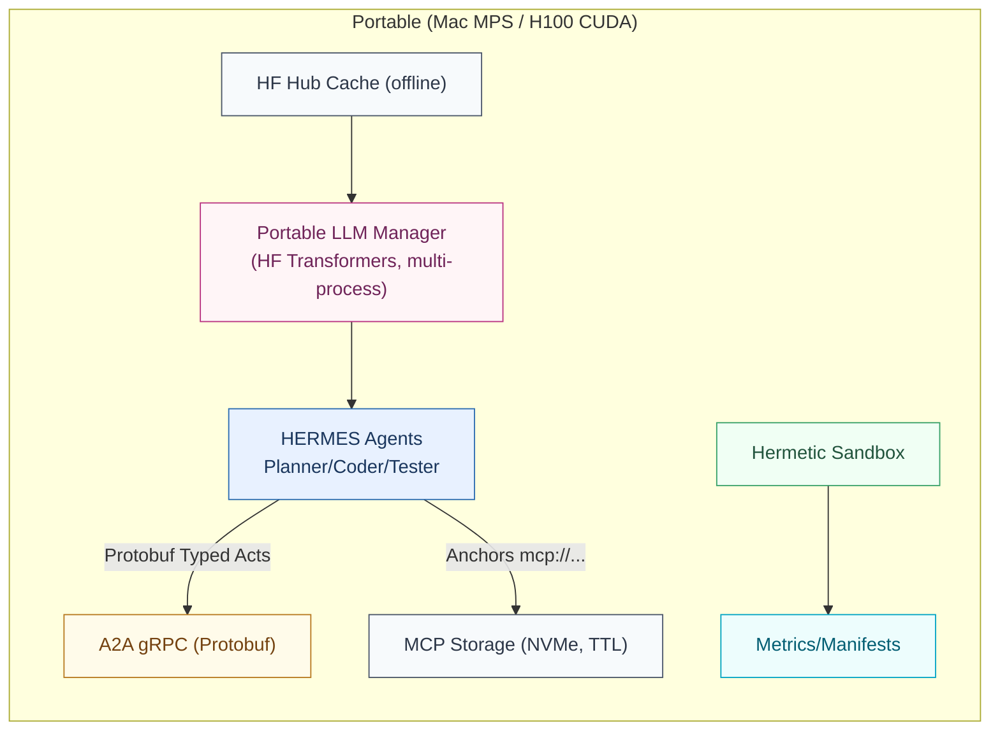

# HERMES MVP Specification

## 1. Overview

HERMES (Heterogeneous Efficient Resource Management & Execution System) is a communication stack for efficient multi-agent LLM workflows. This MVP specification defines the minimal viable implementation for demonstrating core concepts and measuring performance improvements.

## 2. Dev↔Prod Strategy, Models, Quantization, and Why

### 2.1 Default Backend: Portable HF Transformers (Multi-Process)

**Primary Backend**: Portable HuggingFace Transformers with process isolation
- One model instance per OS process via `ProcessPoolExecutor` (spawn context)
- Device mapping determined at runtime:
  - CUDA on H100/A100 GPUs
  - MPS on Apple Silicon
  - CPU fallback when no accelerator available
- Process isolation ensures parallelism even when backend runtime is not thread-safe

### 2.2 Platform-Specific Quantization Policy

#### H100/CUDA Platform
- **Supported**: bitsandbytes 4-bit/8-bit quantization
- Use `BitsAndBytesConfig` for memory optimization
- Device mapping via `accelerate`

#### Apple Silicon/MPS Platform  
- **Not Supported**: bitsandbytes (CUDA-only[^1])
- Alternative approaches:
  - Use smaller models (≤8B parameters)
  - Future: MLX or GGUF quantization formats
- Note: bitsandbytes MPS support is planned/WIP[^2]

### 2.3 Optional Backends (Future PRs)
- **vLLM**: Production deployment on H100
- **Ollama**: Legacy/development use only (concurrency limitations)
- **MLX**: Mac-optimized inference
- **llama.cpp/GGUF**: Cross-platform quantized inference

### 2.4 Offline Model/Hub Policy

For hermetic execution and reproducibility:

**Environment Variables**:
```bash
export HF_HUB_OFFLINE=1          # Disable HF Hub network access[^3]
export TRANSFORMERS_OFFLINE=1    # Disable Transformers network access
export HF_HOME="$PWD/.hf"
export HF_HUB_CACHE="$HF_HOME/hub"
export TRANSFORMERS_CACHE="$HF_HOME/transformers"
```

**Code Configuration**:
```python
model = AutoModel.from_pretrained(
    model_name,
    local_files_only=True,  # Force local cache usage
    cache_dir=cache_dir
)
```

**Pre-cache Models** (one-time, online):
```python
from huggingface_hub import snapshot_download
snapshot_download(
    'meta-llama/Meta-Llama-3.1-8B-Instruct',
    local_dir='./.hf/models/meta-llama/Meta-Llama-3.1-8B-Instruct'
)
```

### 2.5 License and Trust Policy

**License Acceptance**:
- Some models (e.g., Meta Llama) require license acceptance before use
- Accept licenses via HuggingFace Hub web interface or CLI before caching
- Models are cached locally after first download with accepted license

**Remote Code Execution**:
```python
model = AutoModel.from_pretrained(
    model_name,
    local_files_only=True,
    trust_remote_code=False,  # Default: disable remote code execution
    cache_dir=cache_dir
)
```
- Set `trust_remote_code=False` unless explicitly required by the model
- When remote code is required, pin model SHA and audit code before enabling
- Document any models requiring `trust_remote_code=True` with justification

### 2.6 Seed and Telemetry Policy

**Deterministic Seeding**:
```python
# Set for reproducibility in hermetic runs
import random
import numpy as np
import torch

def set_seed(seed: int):
    random.seed(seed)
    np.random.seed(seed)
    torch.manual_seed(seed)
    if torch.cuda.is_available():
        torch.cuda.manual_seed_all(seed)
```

**Telemetry Disabled**:
```bash
# Disable all telemetry and analytics for hermetic execution
export HF_HUB_DISABLE_TELEMETRY=1
export DO_NOT_TRACK=1
export TRANSFORMERS_NO_ADVISORY_WARNINGS=1
export ACCELERATE_DISABLE_TELEMETRY=1
```

## 3. MVP Architecture



### Key Components

1. **Portable LLM Manager**: Multi-process HF Transformers backend
2. **HERMES Agents**: Planner, Coder, Tester agents
3. **A2A Transport**: gRPC with Protobuf serialization
4. **MCP Storage**: Content-addressed storage with TTLs
5. **HF Hub Cache**: Offline model/tokenizer cache
6. **Hermetic Sandbox**: Isolated execution environment
7. **Metrics/Manifests**: Performance tracking and reproducibility

## 4. Performance Targets

### Throughput Expectations (Planning Estimates)

| Platform | Model Size | Quantization | Expected tok/s | Notes |
|----------|------------|--------------|----------------|-------|
| Mac (MPS) | ≤8B | None | 15-25 | No bnb support |
| Mac (MPS) | 3B | None | 30-50 | Smaller models preferred |
| H100 (CUDA) | 8B | 4-bit bnb | 100-200 | With batching |
| H100 (CUDA) | 70B | 4-bit bnb | 50-100 | Memory optimized |

*Note: These are planning estimates, not acceptance criteria*

### Latency & Efficiency Targets

- **E2E Latency**: ≥30% p50 reduction vs baseline
- **Token Efficiency**: ≥40% reduction per solve
- **Message Path p95**: <20ms (H100), <35ms (M1)
- **MCP Deref p95**: <50ms
- **Pass@1**: Within ±2pp of baseline

## 5. Concurrency Model

**Process Isolation Architecture**:
- Spawn N processes via `ProcessPoolExecutor`
- Each process loads model independently
- Device assignment:
  - CUDA: Round-robin across available GPUs
  - MPS: Single device (shared memory)
  - CPU: Thread-based parallelism

**Benefits**:
- Avoids GIL limitations
- Ensures true parallelism
- Handles non-thread-safe backends
- Prevents memory corruption

## 6. Risk Mitigation

| Risk | Impact | Mitigation |
|------|--------|------------|
| BNB unavailable on MPS | No 4/8-bit quantization on Mac | Use smaller models or MLX/GGUF |
| HF offline mode failures | Network access during eval | Set HF_HUB_OFFLINE=1, pre-cache models |
| Process spawn overhead | Slower startup | Warm-up phase, process reuse |
| Memory pressure (Mac) | OOM with large models | Unified memory monitoring, model size limits |

## 7. Implementation Phases

### Phase 1: Core Infrastructure (T1.2)
- [x] SWE-bench Lite loader (PR #7)
- [x] PM benefit-aware anchoring (PR #8)
- [ ] RealTester with MCP deref
- [ ] Transport metrics & byte accounting
- [ ] Hermetic scripts & CI

### Phase 2: Portable Backend (Post-T1.2)
- [ ] PortableMultiInstanceManager
- [ ] Process pool with device mapping
- [ ] Offline mode enforcement
- [ ] Platform-specific quantization

### Phase 3: Advanced Features
- [ ] AASA latent encoding
- [ ] SAE speculative execution
- [ ] RL policy optimization

## 8. Testing Requirements

### Unit Tests
- Process spawn and teardown
- Concurrent generation from multiple instances
- Offline mode with local fixtures
- Platform-specific quantization paths

### Integration Tests
- E2E workflow with hermetic sandbox
- Metrics collection and validation
- Deterministic seeding across processes

### Performance Tests
- Throughput benchmarks by platform
- Memory usage monitoring
- Latency percentiles (p50, p95, p99)

## 9. CI/CD Requirements

### Hermetic Execution
```bash
# Set offline flags
export HERMES_HERMETIC=1
export HF_HUB_OFFLINE=1
export TRANSFORMERS_OFFLINE=1
export HF_DATASETS_OFFLINE=1

# Disable telemetry
export HF_HUB_DISABLE_TELEMETRY=1
export DO_NOT_TRACK=1
export TRANSFORMERS_NO_ADVISORY_WARNINGS=1
export ACCELERATE_DISABLE_TELEMETRY=1

# Run tests
python -m pytest tests/ -q
```

### Artifact Exclusions
- `.hf/**` - Model cache
- `data/**` - Datasets
- `runs/**` - Evaluation outputs
- `.mirrors/**` - Git mirrors
- `scratch/**` - Temporary files

## 10. Acceptance Criteria

### Portable Backend (PR HF-1)
- [ ] 2+ processes run concurrently on Mac (MPS)
- [ ] 4+ processes run concurrently on H100 (CUDA)
- [ ] Offline mode respected with `local_files_only=True`
- [ ] No network access in hermetic tests
- [ ] Platform-specific quantization working

### Performance (T1.2 Complete)
- [ ] Bytes never regress (PM anchoring)
- [ ] Message path p95 meets targets
- [ ] E2E latency reduction demonstrated
- [ ] Pass@1 within tolerance

## 11. Runbook

### One-Time Setup (Online)

```bash
# Install dependencies
pip install transformers accelerate bitsandbytes huggingface_hub

# Pre-download models
python -c "
from huggingface_hub import snapshot_download
snapshot_download(
    'meta-llama/Meta-Llama-3.1-8B-Instruct',
    local_dir='./.hf/models/meta-llama/Meta-Llama-3.1-8B-Instruct'
)
"

# Pre-download datasets
python -m scripts.prepare_swebench_data
```

### Hermetic Evaluation (Offline)

```bash
# Set environment
export HERMES_HERMETIC=1
export HF_HUB_OFFLINE=1
export TRANSFORMERS_OFFLINE=1
export HF_DATASETS_OFFLINE=1
export HF_HOME="$PWD/.hf"
export HF_HUB_CACHE="$HF_HOME/hub"
export TRANSFORMERS_CACHE="$HF_HOME/transformers"

# Disable telemetry
export HF_HUB_DISABLE_TELEMETRY=1
export DO_NOT_TRACK=1
export TRANSFORMERS_NO_ADVISORY_WARNINGS=1
export ACCELERATE_DISABLE_TELEMETRY=1

# Run evaluation
python -m eval.run_arms \
    --arm PM \
    --dataset swebench_lite \
    --instances_file configs/slice20.txt \
    --seed 42 \
    --hermetic on
```

## References

[^1]: HuggingFace bitsandbytes documentation (CUDA-only): https://huggingface.co/docs/bitsandbytes
[^2]: bitsandbytes Apple Silicon discussion: https://github.com/TimDettmers/bitsandbytes/issues/30
[^3]: HF offline environment variables: https://huggingface.co/docs/huggingface_hub/guides/download#download-files-to-local-folder