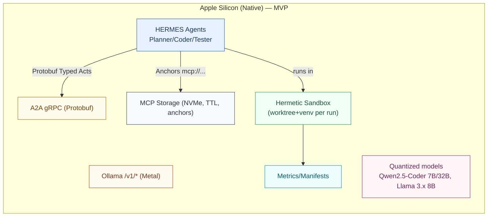

# Project HERMES — MVP-First Plan

**Goal:** In the smallest possible working system, cut tokens/bytes and cut wall-clock latency without hurting pass@1 on SWE-bench Lite. Prove (or falsify) effectiveness quickly; then decide what to build next.

## 0) MVP Thesis (plain English)

**Hypothesis H₁ (tokens/bytes):** Most communication cost comes from chatty JSON/NL and inlined artifacts; switching to structured messages (Typed Acts) and links (MCP Anchors) will reduce tokens/bytes by ≥25–40% with no pass@1 drop.

**Hypothesis H₂ (latency):** A simple speculate→verify→rollback loop (no RL training yet) will reduce p50 E2E latency by ≥10–20% on average; if acceptance stays ≥30%, savings are real even on M1.

**Decision rule:** If we can't show at least (bytes −25%) and (latency −10%) on a 50-task slice without pass@1 harm (±2pp), we pause big investments (AASA/LBE/RL) and reassess.

## 1) MVP Scope (intentionally narrow)

- **Agents:** Planner → Coder → Tester (3 agents). Optional Critic is out for MVP.
- **Transport:** gRPC A2A (local loopback), Protobuf payloads. Content negotiation stubbed.
- **Artifacts:** MCP Anchors for logs/diffs/files; no inline blobs >256 KB.
- **Speculation (SAE):** Heuristic-gated only (no RL training yet). Depth=1.
  - Predict header with a simple heuristic (see §5.2).
  - No AASA training in MVP (latent OFF).
- **Hermetic runs:** Fresh worktree & venv per task; manifests; cleanup enforced.
- **Dev platform:** M1/M2/M3 (Ollama native/Metal), quantized models; then Linux GPU sanity; vLLM/H100 later.

## 2) What we will measure (and how)

### Primary MVP metrics

- **E2E Latency (p50/p95):** start when Planner receives task; end when Tester returns verdict. Monotonic clock.
- **Tokens/Bytes per solve:** log per-turn tokens (prefill/decode) and bytes on wire (payload length + headers).
- **pass@1:** unit-test based success.

### Secondary

- Message-path p95 (encode→transport→decode).
- MCP deref p95 (local NVMe).
- Spec acceptance rate; rollback p95.
- Dev tokens/s (aggregate) for sanity.

### Ensure apples-to-apples

- One `configs/generation.yaml` controls temp/top_p/max_tokens/stop sequences/tool timeouts across all arms.
- Hermetic mode on by default (fresh worktree/venv; outbound network blocked during tests).

## 3) MVP Architecture (only what we need)



**Why this minimal set?**
It isolates H₁/H₂ directly: structured messaging + anchors (bytes) and speculation (latency) with hermetic runs (credibility). Everything else can wait.

## 4) MVP Protocol (Protobuf) & Message Shapes

### Typed Act (MVP subset)

```protobuf
syntax = "proto3";
package hermes;

enum ActType { REQUEST=0; INFORM=1; PROPOSE=2; CONFIRM=3; ERROR=4; }
enum TaskType { PATCH=0; REFACTOR=1; TEST_FIX=2; }

message SymbolicHeader {
  string repo = 1;
  string file_path = 2;
  string test_name = 3;
  TaskType task_type = 4;
  string tool_id = 5; // e.g., PYTEST, PATCH_APPLIER
}

message TypedAct {
  string trace_id  = 1;
  ActType act_type = 2;
  SymbolicHeader header = 3;

  // MVP payloads only:
  oneof payload {
    string mcp_ref = 10;       // Anchor (logs, diffs, files)
    string json_inline = 11;   // Small structured JSON if needed (<32KB)
  }

  // MVP observability & idempotence:
  string epoch = 20;
  string sender = 21;
  string receiver = 22;
  string span_id = 23;
}
```

### MCP Anchors (MVP):

- `put(ref, bytes, ttl_s)`, `resolve(ref)`, `stat(ref)`
- TTLs: logs 24h, diffs 7d, repo snapshots pinned by SHA.

## 5) MVP Speculation (SAE) — exactly what fires & what the Coder sees

### 5.1 When speculation triggers (no RL yet)

**Heuristic gate (all must pass):**
- queue_depth < 0.7
- last_reject_age ≥ 10 s
- planner_elapsed_ms > µ_planner_hist × κ (e.g., κ=0.5) — i.e., planner is mid-turn and historically slow enough to overlap
- Predictability signal available (see 5.2)

### 5.2 What prompt the Coder gets before the Planner finishes

We predict only the header (no learned latent in MVP):

**Predicted header rule (deterministic):**
- `file_path` := top failing file from the latest test log anchor (if available), else the path mentioned most by Planner's partial tokens (we can peek streaming text safely).
- `task_type` := PATCH.
- `test_name` := the failing test case name (from log) or last referenced.
- `tool_id` := PYTEST.

**Speculative prompt template (deterministic):**
```
SYSTEM: "You are a code-repair agent. Apply the smallest patch that makes tests pass. Preserve public API."
USER:
  - task_type=PATCH
  - repo=<repo_sha>
  - file_path=<predicted>
  - test_name=<predicted or last failing>
  - artifacts:
      - mcp://repo/<sha>/<file_path>
      - mcp://logs/<latest_or_empty>
```

**Why deterministic?** MVP must be predictable & debuggable. We use failing-test signals, which are strong predictors of where to patch.

### 5.3 How accept vs. rollback is decided

**ACCEPT (speculation becomes official) iff all:**
- Patch applies cleanly in scratch.
- pytest is green (unit tests pass).
- Logs contain no denylisted errors.

**REJECT otherwise** (including if Planner's authoritative arrives and conflicts). In that case:
- Cancel/kill speculative process.
- Rollback: `rm -rf scratch/<task>/<spec_id>/` and delete speculative anchors.
- Then run the canonical Coder turn using the Planner's authoritative message.

### 5.4 Hermetic & fast scratch

- **Scratch layout:** `scratch/<task_id>/<spec_id>/` (fresh shallow worktree; throwaway venv or cached wheel-cloned venv).
- **Commit (atomic):** diff-apply to canonical worktree; update MCP anchors.
- **Rollback:** idempotent `rm -rf` (target p95 < 150 ms; accept < 250 ms for huge diffs).

## 6) MVP Hermetic Evaluation (clean every time)

- Fresh worktree at base SHA; pinned venv (hash key = requirements.lock).
- Network blocked during tests.
- Manifest per run: model/tokenizer SHAs; quant levels; seeds; OS & python fingerprint; repo SHA; config hashes.
- Cleanup always (try/finally). No leftovers under `/tmp/hermes_*`.
- **Repro check:** two identical runs with same seed → identical summary.parquet (minus timestamps).

## 7) MVP Milestones ▸ Features ▸ Tasks (week-level; each with acceptance & summary md)

**Naming convention for summaries:** `docs/M{milestone}/F{feature}/T{task}_summary.md`

### MVP-0 (Day 0-2): Harness, Baselines, Hermetic

#### F0.1 — Hermetic Sandbox

**T0.1 env/hermetic.py**
- Fresh worktree+venv, network guard, run manifest.
- **Accept:** re-run determinism; no residue.
- **Summary:** docs/MVP0/F0.1/T0.1_summary.md.

#### F0.2 — Unified LLM Client (Ollama first)

**T0.2 clients/llm_client.py**
- OpenAI-compatible calls; 5-call warmup; graceful feature degradation.
- **Accept:** ≥25 tok/s aggregate (post-warmup) on 64-GB M1.
- **Summary:** docs/MVP0/F0.2/T0.2_summary.md.

#### F0.3 — Eval Harness + Parity

**T0.3 eval/run_arms.py**
- Enforce single generation.yaml; seed all RNGs; block overrides.
- **Accept:** same-seed => identical metrics.
- **Summary:** docs/MVP0/F0.3/T0.3_summary.md.

#### F0.4 — Baseline Agents & gRPC

**T0.4 agents/{planner,coder,tester}.py, transport/grpc_impl.py**
- NL JSON baseline (Arm A) and Protobuf baseline (Arm C), local loopback gRPC.
- **Accept:** 10 tasks run E2E; local RTT p95 < 10 ms.
- **Summary:** docs/MVP0/F0.4/T0.4_summary.md.

### MVP-1 (Day 3-4): Cut Bytes Fast (Anchors + Typed Acts)

#### F1.1 — MCP Anchors

**T1.1 mcp/server.py with put/resolve/stat, TTLs (logs 24h, diffs 7d).**
- **Accept:** deref p95 < 50 ms; TTL expiry tested.
- **Summary:** docs/MVP1/F1.1/T1.1_summary.md.

**T1.2 Arm PM (Protobuf + MCP)**
- Swap inline blobs → anchors.
- **Accept:** bytes/solve < Arm C; pass@1 within ±2pp on 20-task smoke.
- **Summary:** docs/MVP1/F1.1/T1.2_summary.md.

#### F1.2 — Typed Acts (Protobuf)

**T1.3 proto/acts.proto + client**
- Minimal fields (header + optional anchor).
- **Accept:** D1 runs; bytes drop vs PM on 20-task smoke.
- **Summary:** docs/MVP1/F1.2/T1.3_summary.md.

### MVP-2 (Day 5-6): Quick Latency Wins (Heuristic SAE)

#### F2.1 — Spec Scratch/Commit/Rollback

**T2.1 sae/manager.py**
- Scratch dirs; atomic commit; idempotent rollback.
- **Accept:** rollback p95 < 150 ms (≤250 ms tail).
- **Summary:** docs/MVP2/F2.1/T2.1_summary.md.

#### F2.2 — Spec Trigger & Prompt Builder

**T2.2 sae/gate.py**
- Heuristic gate (queue, cooldown, planner-elapsed).
- **Accept:** toggles only under defined conditions.
- **Summary:** docs/MVP2/F2.2/T2.2_summary.md.

**T2.3 sae/spec_prompt_builder.py**
- Deterministic header prediction from failing test + partial Planner text; template hydration; anchors.
- **Accept:** same input → identical prompt bytes; handles "no failing test" fallback.
- **Summary:** docs/MVP2/F2.2/T2.3_summary.md.

#### F2.3 — Verifier (strict)

**T2.4 sae/verifier.py**
- Accept if patch applies & pytest green & logs clean; FLAKY = reject.
- **Accept:** deterministic classifications on replay.
- **Summary:** docs/MVP2/F2.3/T2.4_summary.md.

#### F2.4 — Race & TTL Controller

**T2.5 sae/race_controller.py**
- Cancel on authoritative arrival; early abort on patch/apply/compile fail; TTL cap.
- **Accept:** unit tests simulate races; correct cancel & cleanup.
- **Summary:** docs/MVP2/F2.4/T2.5_summary.md.

### MVP-3 (Day 7): Mini-Eval & Decision

#### F3.1 — 50-Task Slice (preregistered)

**T3.1 eval/run_arms.py on 50 tasks:**
- Arms: A (NL JSON), C (Protobuf), PM (Protobuf+MCP), D1 (Typed Acts+MCP), D1+SAE (heuristic).
- **Accept (MVP GO):**
  - Bytes: D1 ≤ 0.75× C (≥25% reduction).
  - Latency: D1+SAE ≤ 0.90× D1 p50 (≥10% faster).
  - pass@1: no worse than ±2 pp vs C.
- **Kill/pivot:** If either bytes or latency fail and pass@1 regresses beyond −2 pp.
- **Summary:** docs/MVP3/F3.1/T3.1_summary.md (include plots & CIs).

## 8) Post-MVP Roadmap (only if MVP passes)

- **Phase-A:** Add LBE (codec) to push bytes −40–50% and p95 encode+decode ≤ 5 ms.
- **Phase-B:** Add AASA (latent) to reduce prompt tokens on hetero teams; start with retrieval-based latent (no training), then train bridge.
- **Phase-C:** Replace SAE heuristic with bandit gating (+ OPE/DR); consider actor-critic if needed.
- **Phase-D:** Staging on Linux (Ollama), then vLLM/H100 throughput.

## 9) Risks & Fallbacks (MVP)

- **Spec acceptance too low (<20%)** → disable SAE by default, continue publishing bytes savings from Anchors+Typed Acts; consider lighter smoke tests (faster verification) to raise acceptance.
- **Header prediction wrong** → acceptance remains test-gated; try stricter rule "accept only if predicted file_path == authoritative file_path," or add tiny most-recent-edit heuristic.
- **Hermetic overhead too high** → cache wheels/venvs by hash; keep correctness.
- **Bytes reductions underwhelm** → ensure all logs/diffs are anchored; raise inline payload cap to 64 KB for real small structured content only; re-audit message shapes.

## 10) Figures to emit in MVP report

- **Fig A:** Bytes/solve CDF for A vs C vs PM vs D1.
- **Fig B:** E2E latency (p50/p95) bars for D1 vs D1+SAE.
- **Table 1:** pass@1 & deltas; acceptance rate; rollback p95; message-path p95; MCP deref p95.
- **Appendix:** per-repo stratification.

## 11) Runbook (MVP)

```bash
# Prepare SWE-bench Lite
bash scripts/prepare_swebench.sh

# Baselines
python -m eval.run_arms --arm A  --seed 1 --gen_cfg configs/generation.yaml --hermetic on
python -m eval.run_arms --arm C  --seed 1 --gen_cfg configs/generation.yaml --hermetic on

# Anchors
python -m eval.run_arms --arm PM --seed 1 --gen_cfg configs/generation.yaml --hermetic on

# Typed Acts + MCP
python -m eval.run_arms --arm D1 --seed 1 --gen_cfg configs/generation.yaml --hermetic on

# D1 + Heuristic SAE
python -m eval.run_arms --arm D1_SAE --seed 1 --gen_cfg configs/generation.yaml --hermetic on

# Mini-eval (50 tasks) and figures
python -m eval.figures --runs runs/A runs/C runs/PM runs/D1 runs/D1_SAE
```

## 12) PR Review Checklist (for every MVP task)

- ✅ Summary at `docs/MVP*/F*/T*_summary.md`
  - What changed / Why / How / Tests / Metrics impact / Deviations / Next steps
- ✅ Unit tests for new modules; integration test for E2E path if applicable
- ✅ Metrics added to logger (bytes, tokens, latency, p95s)
- ✅ Hermetic run verified; manifests present
- ✅ Config parity enforced (no ad-hoc overrides)

## 13) Answering your concerns explicitly

**"What prompt is fed to speculation before the Planner finishes?"**
A deterministic, header-only prompt built from failing test signals (and Planner's partial text as a tiebreaker). No trained latent in MVP. See §5.2.

**"How do we know whether to throw the work away?"**
Strict acceptance: patch applies and tests pass and logs clean. Else reject. See §5.3.

**"How does revert happen?"**
Spec runs in `scratch/<task>/<spec_id>/` and never touches canonical. Rollback is a fast `rm -rf` plus anchor cleanup; commit is an atomic diff-apply. See §5.4.

**"Can we run evals cleanly every time?"**
Yes—hermetic sandbox (fresh worktree/venv, blocked outbound network, manifests, enforced cleanup). See §6.

## 14) Ask to Claude Code (copy/paste)

- `"Implement MVP-0, F0.1, T0.1 (env/hermetic.py)"`
- `"Implement MVP-0, F0.3, T0.3 (eval/run_arms.py) with parity enforcement"`
- `"Implement MVP-1, F1.1, T1.1 (mcp/server.py with TTLs)"`
- `"Implement MVP-1, F1.2, T1.3 (proto/acts.proto and typed_act_client)"`
- `"Implement MVP-2, F2.2, T2.3 (sae/spec_prompt_builder.py) with deterministic header from failing test"`
- `"Implement MVP-2, F2.3, T2.4 (sae/verifier.py) strict acceptance"`
- `"Run MVP-3 mini-eval (50 tasks) and produce figures + summary"`

Each task must produce its markdown summary in `docs/MVP*/F*/T*_summary.md`. I'll review each summary, request changes if needed, and we'll converge fast.